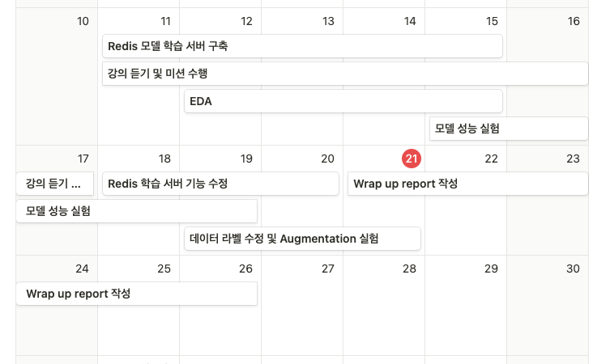
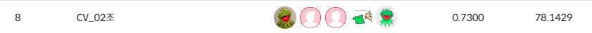

# 마스크 착용 상태 Image Classification

## 😊 팀 구성원
<div align="center">
<table>
  <tr>
    <td align="center"><a href="https://github.com/seheeAn"><br /><sub><b>안세희</b></sub><br />
    </td>
        <td align="center"><a href="https://github.com/Dong-Uri"><br /><sub><b>이동우</b></sub><br />
    </td>
        <td align="center"><a href="https://github.com/Megi2"><br /><sub><b>전진하</b></sub><br />
    </td>
        <td align="center"><a href="https://github.com/MalMyeong"><br /><sub><b>조명현</b></sub><br />
    </td>
        <td align="center"><a href="https://github.com/ChoeHyeonWoo"><br /><sub><b>최현우</b></sub><br />
    </td>
  </tr>
</table>
</div>

<br />

## 😷 프로젝트 개요
지난 3년간 COVID-19는 전 세계적으로 경제와 생산 활동에 큰 제약을 가져왔습니다. 이 바이러스는 주로 입과 호흡기에서 나오는 비말을 통해 전파되므로, 공공장소에서의 올바른 마스크 착용이 중요합니다. 공공장소에서 모든 사람의 마스크 착용 상태를 확인하는 것은 인력적 제약이 있으므로, 카메라를 통해 사람의 얼굴 이미지만으로 마스크 착용 여부를 자동으로 판별할 수 있는 시스템의 개발이 필요합니다. 

<br />

## 📅 프로젝트 일정
프로젝트 전체 일정

- 2023.12.11 ~ 2023.12.22

프로젝트 세부 일정  


<br />

## 🏆 프로젝트 결과
- Private 리더보드에서 최종적으로 아래와 같은 결과를 얻었습니다.  


<br />

## 📁 데이터셋 구조
```
📦datasets
 ┣ 📂eval
 ┃ ┣ 📂images
 ┃ ┣ 📜info.csv
 ┣ 📂train
 ┃ ┣ 📂images
 ┃ ┗ 📜train.csv
 ┗ 📂trainQA
   ┣ 📂images
   ┗ 📜train.csv
```
이 코드는 `부스트캠프 AI Tech`에서 제공하는 데이터셋으로 다음과 같은 구성을 따릅니다. 
- train은 학습에 사용하는 데이터 셋
- eval은 평가에 사용하는 데이터셋
- trainQA는 train 데이터에서 miss labeling된 데이터를 수정한 폴더입니다.

<br />

## 📁 프로젝트 구조
```
📦level1-imageclassification-cv-02
 ┣ 📂.github
 ┃ ┣ 📂ISSUE_TEMPLATE
 ┃ ┃ ┣ 📜bug_report.md
 ┃ ┃ ┗ 📜feature_request.md
 ┃ ┣ 📜.keep
 ┃ ┗ 📜PULL_REQUEST_TEMPLATE.md
 ┣ 📂notebook
 ┃ ┗ 📜sample_submission.ipynb
 ┣ 📂redis_model_scheduler
 ┃ ┣ 📜redis_publisher.py
 ┃ ┗ 📜schedule_search.py
 ┣ 📜.gitignore
 ┣ 📜dataset.py
 ┣ 📜ensemble_weights.py
 ┣ 📜function.py
 ┣ 📜inference.py
 ┣ 📜k-fold-inference.py
 ┣ 📜loss.py
 ┣ 📜model.py
 ┣ 📜requirements.txt
 ┗ 📜train.py
```

#### 1) `dataset.py`
- Dataset class와 Augmentation class를 구현한 파일
- CustomAugmentation, ImgaugAugmentation 구현
#### 2) `loss.py`
- 이미지 분류에 사용될 수 있는 다양한 Loss 들을 정의한 파일
- Cross Entropy, Focal Loss, Label Smoothing Loss, F1 Loss 구현
#### 3) `model.py`
- 학습에 사용한 Model 클래스를 구현한 파일 
- resnet34, resnet50, Resnet34CategoryModel, efficientnet_b0, efficientnet_b1, efficientnet_b2, efficientnet_b5, vit_base_patch16_224, vit_B_16_imagenet1k, vit-age-classifier
#### 4) `train.py`
- 입력 config 값을 training 함수에 전달하는 파일
- wandb를 통한 학습 진행상황 로깅 구현
#### 5) `function.py`
- 입력으로 들어온 파라미터를 통해 train 데이터셋으로 모델 학습을 진행하는 파일
- 조건에 맞는 학습(k-fold, class별 학습)을 진행 후 best 모델을 저장
#### 6) `inference`
- `inference.py` : 학습 완료된 모델을 통해 eval set에 대한 예측 값을 구하고 이를 .csv 형식으로 저장하는 파일 
- `k-fold-inference.py` : hard voting 방식으로 k-fold를 적용하여 예측값을 구하고, 이를 .csv 형식으로 저장하는 파일
#### 7) `ensemble_weights.py`
- 여러 학습 모델들로 생성한 결과들을 hard voting하여 앙상블된 결과를 추론하는 파일
- inference 파일을 통해 생성된 .csv 파일을 입력으로 받아 새로운 .csv 파일을 생성 및 저장
#### 8) `redis_model_scheduler`
- `redis_publisher.py` : redis queue에 원하는 학습 config 값을 전달하는 파일
- `schedlue_search.py` : redis queue에서 학습을 기다리고 있는 config 값을 조회 및 삭제하는 기능 구현

<br />

## ⚙️ requirements

- black==23.9.1
- matplotlib==3.8.2
- numpy==1.26.0
- pandas==2.1.4
- Pillow==9.4.0
- python-dotenv==1.0.0
- scikit-learn==1.2.2
- tensorboard==2.15.1
- torch==2.1.0
- torchvision==0.16.0
- timm==0.9.12
- transformers==4.36.2
- pytorch-pretrained-vit==0.0.7
- wandb==0.16.1
- redis==5.0.1
- GitPython==3.1.40
- imgaug==0.4.0
- efficientnet-pytorch ==0.7.1

`pip3 install -r requirements.txt`

<br />

## ▶️ 실행 방법

#### Train
`python train.py --name [실험명]`

#### Inferecne
`python inference.py --model_dir [모델저장경로]`

#### scheduler를 통한 실행
`python redis_publisher.py --ip [ip주소] --port [port번호] --user [이름]`  

`python ~~.py --ip [ip주소] --port [port번호] --mode [mode이름]`


<br />

## ✏️ Wrap-Up Report   
- [Wrap-Up Report](링크)